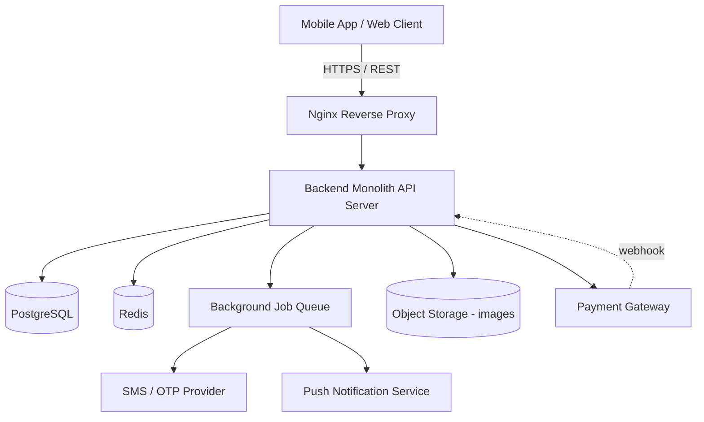
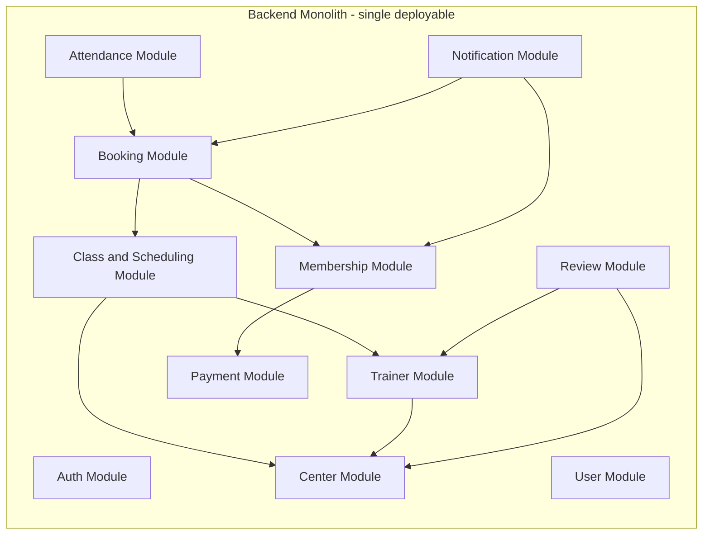
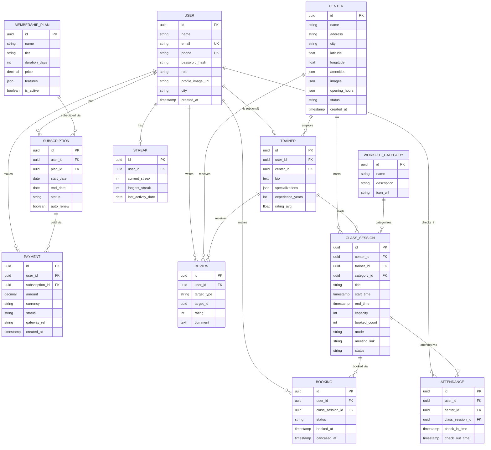
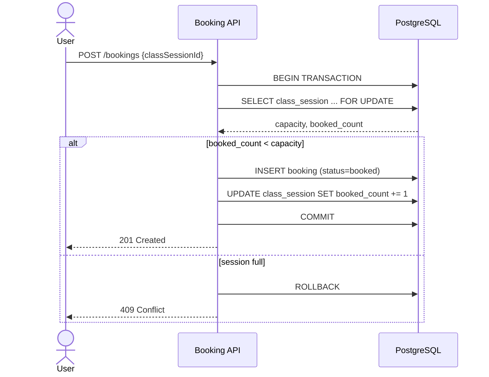
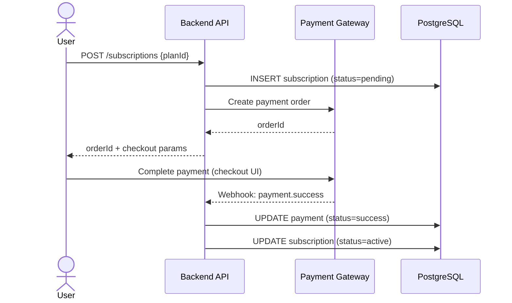

# Gym & Fitness Booking App — Backend Design Document

> A Cult.fit-style fitness platform: browse gym centers, book classes, manage memberships & payments, track attendance.
> **Scoped for:** a solo learning/portfolio build, as a **modular monolith**. Modules are cleanly separated so they *could* be split into services later — but nothing here requires that up front.

## Table of Contents
- [1. Overview](#1-overview)
- [2. Functional Requirements](#2-functional-requirements)
- [3. Non-Functional Requirements](#3-non-functional-requirements)
- [4. High-Level Architecture](#4-high-level-architecture)
- [5. Module Breakdown](#5-module-breakdown)
- [6. Database Design](#6-database-design)
- [7. API Design](#7-api-design)
- [8. Authentication and Authorization](#8-authentication-and-authorization)
- [9. Key Flows](#9-key-flows)
- [10. Tech Stack](#10-tech-stack)
- [11. Deployment](#11-deployment)
- [12. Security Considerations](#12-security-considerations)
- [13. Build Roadmap](#13-build-roadmap)
- [14. Out of Scope for v1](#14-out-of-scope-for-v1)

---

## 1. Overview

The system lets users discover gym centers, book group fitness classes or personal training slots, buy membership plans, pay for them, check in at centers, and rate their experience. Admins manage centers, trainers, classes, and plans.

This design uses a **single deployable backend service** (a "modular monolith") rather than microservices — the right call for one person building this end-to-end. Internally it's organized into clearly bounded modules (Auth, Booking, Payment, etc.) with minimal cross-module coupling, so if you ever *do* want to split something out (Payment and Notification are the usual first candidates), the boundary work is already done.

**At a glance, v1 covers:** auth, centers, trainers, classes/scheduling, bookings, membership plans, subscriptions, payments, attendance, and reviews. Notifications and streaks are included in the design but flagged as later phases (see [Roadmap](#13-build-roadmap)).

## 2. Functional Requirements

- **Users & Auth** — sign up / log in via phone+OTP or email+password; manage profile; roles are `customer`, `trainer`, `admin`.
- **Centers** — browse gym centers, view details (amenities, photos, hours), search nearby by geolocation.
- **Trainers** — browse trainer profiles, specializations, ratings, and their upcoming schedule.
- **Classes & Scheduling** — browse class sessions by center, category, date; each session has a trainer, capacity, and mode (in-center or online).
- **Bookings** — book a slot in a class session, cancel a booking, view booking history.
- **Membership Plans & Subscriptions** — browse plans (tiered, e.g. Pro / Elite), subscribe, view active subscription, cancel auto-renew.
- **Payments** — pay for a subscription via a payment gateway, view payment history.
- **Attendance** — check in (and out) at a center, typically via QR code tied to a booking or active membership.
- **Reviews & Ratings** — rate and review centers and trainers.
- **Notifications** *(Phase 5)* — class reminders, subscription expiry alerts, streak nudges.
- **Admin** — create/update centers, trainers, classes, and plans. Not a separate module — see [§5](#5-module-breakdown).

## 3. Non-Functional Requirements

- **Consistency** — strong consistency for bookings (never overbook a session) and payments (a payment must map to exactly one subscription, no double-charging).
- **Security** — hashed passwords, short-lived JWTs, no raw card data ever touches your servers.
- **Performance** — read-heavy endpoints (center/class listings) should be cacheable; target sub-300ms on cached reads.
- **Availability** — single-region deployment is fine for v1; the design shouldn't *block* later horizontal scaling (stateless API layer, externalized session/cache state).
- **Maintainability** — clear module boundaries, typed code, documented API (OpenAPI/Swagger generated from code, not hand-maintained).

## 4. High-Level Architecture



Internally, the monolith is split into modules with intentional one-way dependencies (no circular imports):



Every module also depends on Auth/User for identity — omitted from the diagram to keep it readable.

## 5. Module Breakdown

| Module | Responsibility |
|---|---|
| **Auth** | Registration, login, OTP verification, JWT issuance & refresh |
| **User** | Profile management, role handling |
| **Center** | Gym center CRUD, geo/nearby search |
| **Trainer** | Trainer profiles, home center, schedule |
| **Class & Scheduling** | Class session CRUD, workout category management |
| **Booking** | Slot booking/cancellation, capacity enforcement |
| **Membership** | Plan catalog, subscription lifecycle |
| **Payment** | Order creation, gateway integration, webhook handling |
| **Attendance** | QR check-in/out, attendance history |
| **Review** | Ratings & reviews for centers and trainers |
| **Notification** *(Phase 5)* | In-app, push, and SMS dispatch; streak tracking can live here too |

**Admin isn't a separate module.** It's admin-role-guarded endpoints inside each domain module (`POST /centers`, `POST /classes`, etc.) — a dedicated admin module would just duplicate logic that already belongs elsewhere.

## 6. Database Design



**Design notes:**
- **UUID primary keys** everywhere — avoids leaking sequential IDs and sidesteps future ID-collision issues if you ever shard.
- **`class_session.booked_count`** is denormalized for fast capacity checks. It must be updated in the *same transaction* as the booking insert (row-locked — see [§9.1](#9-key-flows)) or you'll get race-condition overbooking under concurrent requests.
- **`review.target_id`** is a polymorphic reference (points to `center.id` or `trainer.id` depending on `target_type`). This trades strict FK integrity for one table instead of two — reasonable here; switch to separate `center_review`/`trainer_review` tables if you want the DB to enforce referential integrity.
- **Trainer → one Center**: kept simple (trainer has a single home center) rather than a many-to-many join table. Promote to a join table later if you need trainers floating across multiple centers.
- **Recommended indexes**: `class_session(center_id, start_time)`, `booking(user_id)`, `subscription(user_id, status)`, `payment(user_id)`, `attendance(user_id, check_in_time)`.
- Prefer **soft deletes** (`status` / `deleted_at`) over hard deletes on `center`, `class_session`, and `user` for auditability.

## 7. API Design

*(Auth column: **Public** = no token needed · **User** = any authenticated user · **Admin** / **Trainer** = role-restricted)*

### 7.1 Auth
| Method | Path | Description | Auth |
|---|---|---|---|
| POST | `/api/v1/auth/register` | Register with email/phone + password | Public |
| POST | `/api/v1/auth/login` | Log in, returns access + refresh token | Public |
| POST | `/api/v1/auth/otp/send` | Send OTP to phone | Public |
| POST | `/api/v1/auth/otp/verify` | Verify OTP, returns tokens | Public |
| POST | `/api/v1/auth/refresh` | Refresh an access token | Refresh token |
| POST | `/api/v1/auth/logout` | Invalidate refresh token | User |

### 7.2 Users
| Method | Path | Description | Auth |
|---|---|---|---|
| GET | `/api/v1/users/me` | Get own profile | User |
| PATCH | `/api/v1/users/me` | Update own profile | User |
| GET | `/api/v1/users/:id` | Get any user by id | Admin |

### 7.3 Centers
| Method | Path | Description | Auth |
|---|---|---|---|
| GET | `/api/v1/centers` | List centers (filter by city) | Public |
| GET | `/api/v1/centers/nearby?lat=&lng=&radius=` | Nearby centers | Public |
| GET | `/api/v1/centers/:id` | Center details | Public |
| POST | `/api/v1/centers` | Create center | Admin |
| PATCH | `/api/v1/centers/:id` | Update center | Admin |

### 7.4 Trainers
| Method | Path | Description | Auth |
|---|---|---|---|
| GET | `/api/v1/trainers` | List trainers (filter by center/specialization) | Public |
| GET | `/api/v1/trainers/:id` | Trainer profile | Public |
| GET | `/api/v1/trainers/:id/schedule` | Trainer's upcoming sessions | Public |

### 7.5 Classes & Scheduling
| Method | Path | Description | Auth |
|---|---|---|---|
| GET | `/api/v1/classes` | List sessions (filter by center, category, date) | Public |
| GET | `/api/v1/classes/:id` | Session details | Public |
| POST | `/api/v1/classes` | Create a session | Admin/Trainer |
| PATCH | `/api/v1/classes/:id` | Update or cancel a session | Admin/Trainer |

### 7.6 Bookings
| Method | Path | Description | Auth |
|---|---|---|---|
| POST | `/api/v1/bookings` | Book a class session | User |
| GET | `/api/v1/bookings/me` | My bookings (upcoming/past) | User |
| DELETE | `/api/v1/bookings/:id` | Cancel a booking | User |

```json
// POST /api/v1/bookings — request
{ "classSessionId": "b3f1c2b0-1234-4a5b-9c1d-abc123456789" }

// 201 response
{
  "id": "a91e7f10-...",
  "classSessionId": "b3f1c2b0-...",
  "status": "booked",
  "bookedAt": "2026-08-24T10:00:00Z"
}
```

### 7.7 Membership Plans & Subscriptions
| Method | Path | Description | Auth |
|---|---|---|---|
| GET | `/api/v1/plans` | List membership plans | Public |
| POST | `/api/v1/subscriptions` | Subscribe to a plan (creates a payment order) | User |
| GET | `/api/v1/subscriptions/me` | My active/past subscriptions | User |
| POST | `/api/v1/subscriptions/:id/cancel` | Cancel auto-renew | User |

### 7.8 Payments
| Method | Path | Description | Auth |
|---|---|---|---|
| POST | `/api/v1/payments/verify` | Verify payment after gateway checkout | User |
| POST | `/api/v1/webhooks/payments` | Gateway server-to-server webhook | Gateway signature |
| GET | `/api/v1/payments/me` | Payment history | User |

### 7.9 Attendance
| Method | Path | Description | Auth |
|---|---|---|---|
| POST | `/api/v1/attendance/checkin` | Check in via QR / booking id | User |
| POST | `/api/v1/attendance/checkout` | Check out | User |

### 7.10 Reviews
| Method | Path | Description | Auth |
|---|---|---|---|
| POST | `/api/v1/reviews` | Submit a review (center or trainer) | User |
| GET | `/api/v1/centers/:id/reviews` | Center reviews | Public |
| GET | `/api/v1/trainers/:id/reviews` | Trainer reviews | Public |

### 7.11 Notifications *(Phase 5)*
| Method | Path | Description | Auth |
|---|---|---|---|
| GET | `/api/v1/notifications` | My notifications | User |
| PATCH | `/api/v1/notifications/:id/read` | Mark as read | User |

## 8. Authentication and Authorization

- **Tokens**: short-lived JWT access token (~15 min) + longer-lived refresh token (~30 days), refresh token stored hashed and rotated on each use.
- **Primary login**: phone + OTP (matches how most Indian fitness apps, including Cult.fit, onboard users); email + password as an alternative.
- **Password hashing**: bcrypt or argon2 — never store or log plaintext.
- **RBAC**: `customer`, `trainer`, `admin`. Route guards enforce role checks per endpoint (see Auth column in [§7](#7-api-design)).
- **Rate limiting**: Redis-backed limits on auth and OTP endpoints to block brute-force and OTP-spam abuse.

## 9. Key Flows

### 9.1 Class Booking (concurrency-safe)



The `SELECT ... FOR UPDATE` row lock is what prevents two simultaneous requests from both slipping into the last open slot.

### 9.2 Subscription Purchase



Activation happens off the **webhook**, not the client's "I paid" callback — the client-side callback is only used to show a "processing" state, since it can't be trusted on its own.

## 10. Tech Stack

| Layer | Choice | Why |
|---|---|---|
| Language/Framework | **Node.js + NestJS** (TypeScript) | Its module system maps 1:1 onto the module breakdown in §5; strong ecosystem; TypeScript is a plus for a portfolio |
| Database | **PostgreSQL** | Bookings, subscriptions, and payments are relational with strict consistency needs (no overbooking, no orphaned payments) — a better fit than a document store |
| ORM | **Prisma** | Type-safe queries, straightforward migrations |
| Cache / Queue | **Redis + BullMQ** | Cache hot reads (center/class listings); back async jobs (notifications, subscription-expiry checks) |
| Auth | **JWT** (NestJS Passport strategy) + bcrypt | Standard, well-documented |
| File storage | **AWS S3 / Cloudflare R2** (local disk for dev) | Profile & center images |
| Payments | **Razorpay** (or Stripe) | Razorpay fits the Cult.fit-style India market |
| SMS/OTP | **MSG91 / Twilio** | — |
| Push notifications | **Firebase Cloud Messaging** | — |
| API docs | **Swagger/OpenAPI** via NestJS decorators | Generated from code, stays in sync |
| Testing | **Jest + Supertest** | — |
| Containers | **Docker + docker-compose** | App + Postgres + Redis for local dev |

This isn't locked in — the module boundaries and schema map just as cleanly onto Django (Python) or Spring Boot (Java) if you'd rather build in one of those.

## 11. Deployment

- **Local dev**: `docker-compose up` — API + Postgres + Redis.
- **Hosting**: a single instance on Railway / Render / Fly.io (or a lone EC2 box). No need for Kubernetes or multi-region for a portfolio project — that complexity wouldn't teach you much here and would mostly cost you time.
- **CI/CD**: GitHub Actions — run tests on every PR, deploy on merge to `main`.
- **Config**: environment variables via `.env` locally, the platform's secret store in production.
- **Observability**: structured logs (pino/winston), a `/health` endpoint, optionally a free-tier Sentry for error tracking.

## 12. Security Considerations

- Never store raw card data — rely on the gateway's hosted checkout/tokenization.
- Hash passwords (bcrypt/argon2); never log secrets, tokens, or full card/payment payloads.
- Validate and sanitize all inputs (`class-validator` in NestJS, or Zod).
- Rate-limit auth, OTP, and payment endpoints.
- HTTPS everywhere; secure cookie flags if refresh tokens go in cookies.
- Role guard on *every* admin/trainer-restricted route — don't rely on the frontend to hide the button.
- Verify payment-gateway webhook signatures before trusting a webhook payload.

## 13. Build Roadmap

1. **Phase 1 — Foundation**
   - Project scaffold (NestJS + Prisma + Postgres + Redis via docker-compose)
   - Auth module: register, login, OTP send/verify, JWT issuance
   - User module: profile get/update

2. **Phase 2 — Browse & Discover**
   - Center module (CRUD + nearby search)
   - Trainer module (profiles, schedule)
   - Class & Scheduling module (session listing, categories)

3. **Phase 3 — Core Transaction Loop**
   - Booking module with concurrency-safe capacity handling
   - Attendance/check-in module

4. **Phase 4 — Monetization**
   - Membership plan catalog
   - Subscription lifecycle
   - Payment gateway integration (sandbox mode)

5. **Phase 5 — Engagement**
   - Reviews & ratings
   - Notifications (in-app, push, SMS)
   - Streak tracking (stretch)

6. **Phase 6 — Polish & Ship**
   - Admin-guarded endpoints across modules
   - Swagger/OpenAPI docs
   - Unit + integration tests
   - Dockerize, deploy, seed demo data

Build in this order — each phase is independently demoable, which is useful for a portfolio project (you have something to show after Phase 2, not just after everything is done).

## 14. Out of Scope for v1

Deliberately left out, to keep this buildable solo:
- Multi-region deployment or geo-distributed databases
- A full microservices split (the module boundaries make this possible *later*, not necessary now)
- Custom live-streaming infra for online classes — just store a `meeting_link` (Zoom/Meet) on the session instead
- ML-based recommendations
- Multi-currency / multi-country support